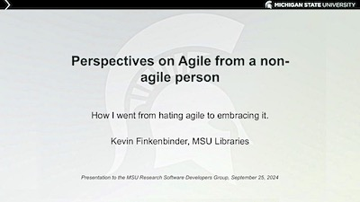

*A recap of last months meeting, announcements, and our next meeting coordinates...*

<!-- more -->

### September Meeting Recap

We held our September meeting on the 25th in the ICER Seminar room.   Kevin Finkenbinder gave a great presentation describing the history and practice of Scrum and Agile and his experience adopting it for the library web dev team.  He gave us great advice for things that work ( and things that don't!)   We had a discussion from those who've worked in academia and industry where *'agile'* was named but not
really practiced.    Kevin had a great section that he called 'Dark Agile' or anti-patterns in it's practice.    "It's called a stand-up for a reason!"

 
[Presentation: Perspectives on Agile from a non-agile person (K. Finkenbinder)](../../img/Finkenbinder_2024_Perspectives_on_Agile_from_a_non-agile_person.pdf)  (PDF, 407K)

### News/Highlights

ICER's Craig Gross ( grosscra@msu.edu ) has organized the MSU "Programming in Practice learning community," held Tuesdays from 4:00-5:00PM in the MSU Library. 

They are working through the on-line book [Research Software Engineering with Python](https://third-bit.com/py-rse/), "for researchers who are already using Python for their data analysis, but who want to take their coding and software development to the next level..." 
I attended the first event on October 1st and this will be great resource.   While they held their first meeting, please contact Craig if you, or if you know of someone who is making the journey from code to software dev.  

If you haven't heard of [PyOpenSci](https://www.pyopensci.org/) you should check it out.   I learned about it at last year's US-RSE 
conference.  Patterned after [ROpenSci](https://ropensci.org/).  Both organizations help develop packages for the sciences via community driven learning, review, and maintenance of contributed software.    PyOpenSci is holding a [pyOpenSci Fall Festival](https://www.pyopensci.org/events/pyopensci-2024-fall-festival.html) October 28 - November 1 with keynotes and full-day workshops.  It's not free but there are scholarships.   I'm sharing this event as the workshops look really good and topical.   

### Next Meeting October 30, 3pm

The next meeting of the MSU Research Software Developers Group will be held:

- 3pm, Wednesday October 30th  
- Room 211 (Red Cedar Instruction room), MSU Main Library, West Wing, Second floor
  - room info: https://lib.msu.edu/spaces/main-library/2nd-floor-west-wing/red-cedar-instruction-room

The US Research Software Engineering annual conference is going on now in Albequerque, NM.   We will hear a summary of that meeting 
and discuss ways to be more involved.   

We will offer a zoom link for those who can't attend, sent to our email list, and on the MSU Teams channel.  Feel free to [contact us](../../contact.md)